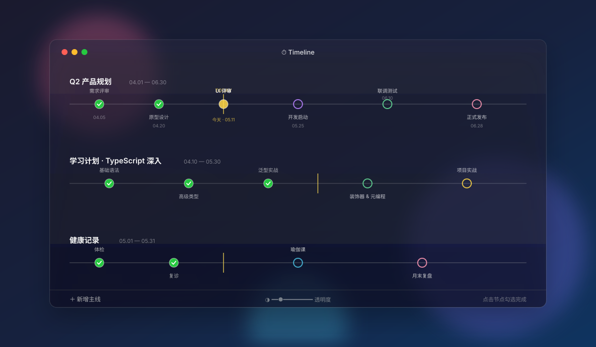
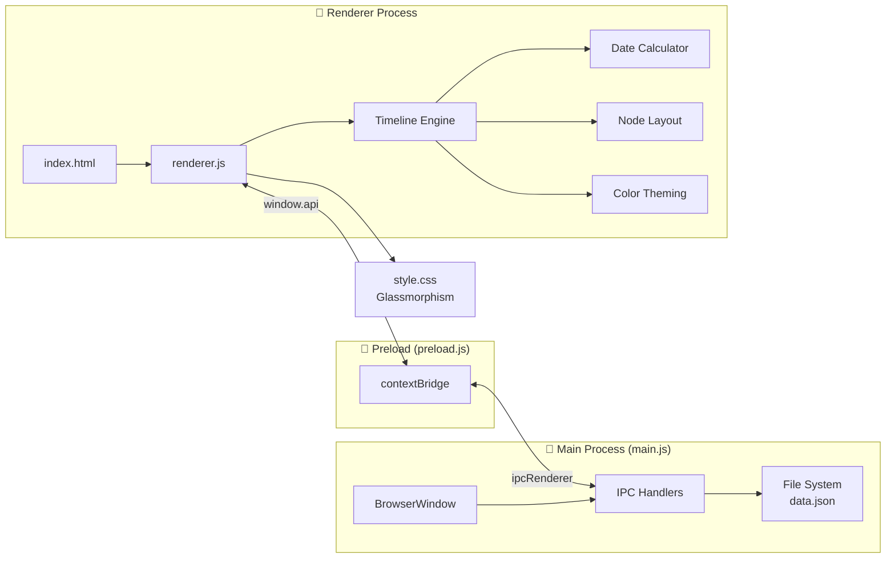

<div align="center">



# ⏱ Timeline App

### **A beautiful floating timeline task manager for macOS**

*Glassmorphism design · Always-on-top · Drag anywhere · Built with Electron*

<br/>

[](https://github.com/fuxiangPro/timeline-app/releases)
[](https://www.electronjs.org/)
[](https://developer.mozilla.org/en-US/docs/Web/JavaScript)
[](./LICENSE)

[](https://github.com/fuxiangPro/timeline-app/stargazers)
[](https://github.com/fuxiangPro/timeline-app/network/members)
[](https://github.com/fuxiangPro/timeline-app/issues)
[](https://github.com/fuxiangPro/timeline-app/commits/main)

<br/>

**[📥 Download](https://github.com/fuxiangPro/timeline-app/releases/latest)** ·
**[🐛 Report Bug](https://github.com/fuxiangPro/timeline-app/issues/new?template=bug_report.yml)** ·
**[✨ Request Feature](https://github.com/fuxiangPro/timeline-app/issues/new?template=feature_request.yml)** ·
**[💬 Discussions](https://github.com/fuxiangPro/timeline-app/discussions)**

</div>

---

## 🌟 Why Timeline App?

> **传统的待办应用太线性，看不到时间的全貌。**

Timeline App 用一种**全新的方式**管理任务：把任务以**节点的形式分布在时间轴上**，让你一眼看清未来一段时间所有重要时刻。

它不打扰你 — 半透明毛玻璃浮窗悬浮在桌面，需要时点开，不需要时融入背景。

<br/>

<div align="center">

### **One floating window · All your timelines · Always there**

</div>

---

## ✨ Features

<table>
<tr>
<td width="50%" valign="top">

### 🎨 极致美学
- **毛玻璃半透明** 浮窗设计，融入桌面
- **可调透明度** — 0% 到 100% 自由滑动
- **5 色主题** 节点 — 粉/绿/黄/紫/默认
- **白色文字** 风格，简约不刺眼

</td>
<td width="50%" valign="top">

### ⏱ 时间轴智能
- **按日期自动排列** 节点位置
- **今日竖线标记** 当前进度一目了然
- **重叠节点** 自动错位 & 上下交替显示
- **多主线** 并列展示，分类清晰

</td>
</tr>
<tr>
<td width="50%" valign="top">

### 🪟 浮窗交互
- **置顶切换** — 📌 一键固定在最上层
- **拖动任意位置** — 无边框窗口随心摆放
- **悬停才显示** 控制栏，专注不被打扰
- **窗口控制** — 关闭 / 最小化 / 缩放

</td>
<td width="50%" valign="top">

### 📝 任务管理
- **点击勾选** 完成状态切换
- **内联编辑** 名称、日期、颜色、备注
- **双击编辑** 主线名称和起止日期
- **本地存储** — 数据保存在 `data.json`，无云端依赖

</td>
</tr>
</table>

---

## 📸 Screenshots

<div align="center">

> 📌 **以下是真实截图占位 — 安装运行后截图替换 `docs/images/` 即可。** 当前 banner 是基于真实 UI 风格制作的 SVG 预览图。

<table>
<tr>
<td align="center" width="50%">
<b>主界面（多主线）</b><br/>
<sub>建议尺寸 1200×700</sub><br/>

</td>
<td align="center" width="50%">
<b>节点编辑弹窗</b><br/>
<sub>建议尺寸 1200×700</sub><br/>

</td>
</tr>
<tr>
<td align="center" width="50%">
<b>半透明融入桌面</b><br/>
<sub>建议尺寸 1200×700</sub><br/>

</td>
<td align="center" width="50%">
<b>颜色主题节点</b><br/>
<sub>建议尺寸 1200×700</sub><br/>

</td>
</tr>
</table>

</div>

---

## 🚀 Quick Start

### Option 1: 一键安装（推荐）

最简单 — 双击 `.command` 文件自动解压、安装依赖、启动：

```bash
# 下载 installer/timeline-app.command 后直接双击
# 或在终端运行：
chmod +x timeline-app.command
./timeline-app.command
```

> 💡 该脚本会在当前目录创建 `timeline-app-fuxiang/` 子目录，存放完整代码和 `data.json`。

### Option 2: 从源码运行

```bash
# 1. Clone 仓库
git clone https://github.com/fuxiangPro/timeline-app.git
cd timeline-app

# 2. 安装依赖（首次约 1-2 分钟）
npm install

# 3. 启动应用
npm start
```

### Option 3: 开发模式

```bash
# 带 Chromium 日志输出，方便调试
npm run dev
```

---

## 🛠 Tech Stack

<div align="center">

| Layer | Tech | Reason |
|:-----:|:----:|:-------|
| **Runtime** |  | 跨平台桌面应用，原生窗口能力 |
| **Frontend** |    | 零构建，轻量直接 |
| **Visual** | `backdrop-filter` + `rgba()` | 原生毛玻璃效果 |
| **Storage** | `data.json` (file system) | 无云端依赖，完全本地 |
| **IPC** | `contextBridge` + `ipcRenderer` | 安全的进程间通信 |

</div>

---

## 🏗 Architecture



### 文件结构

```
timeline-app/
├── main.js              # 🎯 Electron 主进程：窗口创建、IPC 处理
├── preload.js           # 🌉 安全桥接 API
├── renderer.js          # 🎨 全部前端逻辑（渲染、交互、数据）
├── index.html           # 📄 页面结构
├── style.css            # 💎 所有样式（CSS 变量集中在 :root）
├── data.json            # 💾 本地数据持久化（自动生成）
├── installer/
│   └── timeline-app.command  # 📦 一键安装器（自解压脚本）
├── docs/
│   └── images/          # 🖼  截图与示例图
├── .github/
│   ├── ISSUE_TEMPLATE/  # Issue 表单模板
│   ├── workflows/       # CI/CD
│   ├── PULL_REQUEST_TEMPLATE.md
│   └── FUNDING.yml
├── LICENSE              # MIT
├── CONTRIBUTING.md      # 贡献指南
├── CODE_OF_CONDUCT.md   # 行为准则
├── SECURITY.md          # 安全策略
└── CHANGELOG.md         # 版本日志
```

---

## 🎯 Usage Guide

### 创建第一个主线

1. 点击底部 **`＋ 新增主线`** 按钮
2. 输入主线名称（如 "Q2 产品规划"）
3. 选择起止日期 — 时间轴会自动按比例渲染

### 添加节点

1. 点击主线右侧的 **`＋`** 图标
2. 填写：
   - 📝 **任务名称**
   - 📅 **日期**（必须在主线起止范围内）
   - 🎨 **颜色**（默认/粉/绿/黄/紫）
   - 💬 **备注**（可选）

### 交互快捷操作

| 操作 | 效果 |
|------|------|
| 单击节点圆圈 | 切换完成状态 ✓ |
| 单击节点文字/日期 | 打开编辑弹窗 |
| 双击主线名称 | 内联编辑名称 |
| Hover 节点文字 300ms | 显示完整名称 tooltip |
| Hover 主线 | 显示删除按钮（4 秒自动取消） |
| 底部透明度滑条 | 调整整窗口透明度 |
| 📌 按钮 | 切换窗口置顶状态 |

---

## ❓ FAQ

<details>
<summary><b>🤔 为什么需要 Node.js？我不是开发者。</b></summary>
<br/>
Electron 应用需要 Node.js 环境运行。最简单的方式是安装 <a href="https://nodejs.org">Node.js LTS 版本</a>，或者用 <code>brew install node</code>。一次安装，永久使用。
<br/>
未来我们计划提供 <code>.dmg</code> 安装包，到时就不需要 Node.js 了。
</details>

<details>
<summary><b>💾 我的数据存在哪里？会丢失吗？</b></summary>
<br/>
数据存在应用目录下的 <code>data.json</code> 文件中，<b>完全本地</b>，不上传任何云端。
<br/>
<code>.command</code> 一键安装器在更新时会<b>自动备份并恢复</b>你的 <code>data.json</code>。
<br/>
建议你定期手动备份这个文件到 iCloud 或其他云盘以防意外。
</details>

<details>
<summary><b>🪟 窗口为什么不能始终在最底层（贴在桌面）？</b></summary>
<br/>
macOS 系统不允许"可交互且永远在最底层"的窗口。当前方案是普通层级（<code>alwaysOnTop: false</code>），点击窗口会浮上来。这是系统正常行为，不是 bug。
<br/>
如需置顶，点击 📌 按钮即可。
</details>

<details>
<summary><b>🎨 我能自定义主题颜色吗？</b></summary>
<br/>
当然！编辑 <code>style.css</code> 顶部的 <code>:root</code> CSS 变量即可。所有颜色都集中在那里。
<br/>
节点颜色定义在 <code>renderer.js</code> 的 <code>COLOR_MAP</code> 对象中。
</details>

<details>
<summary><b>🪟 支持 Windows / Linux 吗？</b></summary>
<br/>
目前专为 macOS 设计（毛玻璃、窗口控制按钮等）。Electron 本身跨平台，但部分 UI 细节需要调整。
<br/>
欢迎提 PR 适配其他平台！
</details>

---

## 🗺 Roadmap

- [ ] 📦 提供 `.dmg` 打包，无需安装 Node.js
- [ ] 🌙 浅色 / 深色主题切换
- [ ] 📤 数据导入导出（JSON / CSV）
- [ ] ☁️ 可选的 iCloud / Dropbox 同步
- [ ] 🔔 节点临近提醒（系统通知）
- [ ] 🌐 多语言支持（中/英）
- [ ] 🪟 Windows / Linux 适配
- [ ] 📊 完成率统计视图

See [open issues](https://github.com/fuxiangPro/timeline-app/issues) for the full list.

---

## 🤝 Contributing

Contributions are what make the open source community amazing 💖

Please read [CONTRIBUTING.md](./CONTRIBUTING.md) and [CODE_OF_CONDUCT.md](./CODE_OF_CONDUCT.md) before getting started.

```bash
# 1. Fork → Clone → Branch
git checkout -b feature/awesome

# 2. Make your changes & test
npm start

# 3. Commit using Conventional Commits
git commit -m "feat: add awesome thing"

# 4. Push & open a Pull Request
git push origin feature/awesome
```

### Top Contributors

<a href="https://github.com/fuxiangPro/timeline-app/graphs/contributors">
  
</a>

---

## 📄 License

Distributed under the **MIT License**. See [LICENSE](./LICENSE) for more information.

---

## 💖 Acknowledgments

Built with care using:
- [Electron](https://www.electronjs.org/) — the battle-tested desktop framework
- [Apple Human Interface Guidelines](https://developer.apple.com/design/human-interface-guidelines/) — for design inspiration
- Glassmorphism design language ([What is Glassmorphism?](https://uxdesign.cc/glassmorphism-in-user-interfaces-1f39bb1308c9))

---

<div align="center">

### **If this project helps you, please give it a ⭐️**

#### Made with ❤️ by [fuxiang](https://github.com/Pitt-Lee)

<sub>Powered by Electron · Designed for macOS · Open source forever</sub>

</div>
